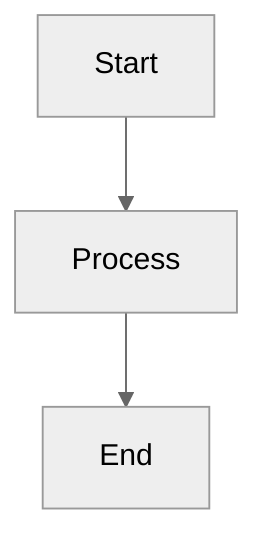
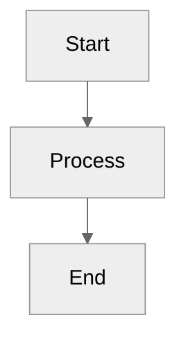
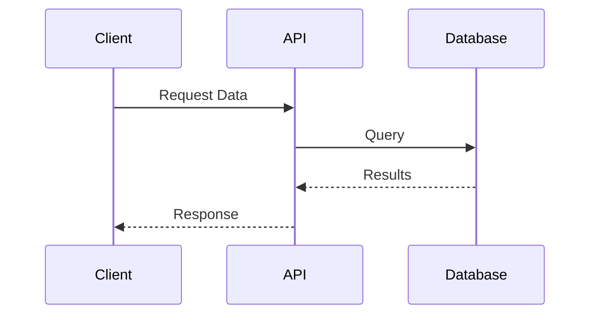
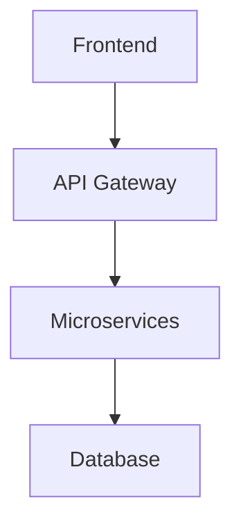
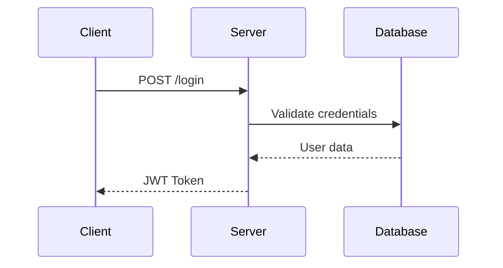

# MarkdownToWord (md2word)

[](https://github.com/edsonbassani/markdown-to-word/actions/workflows/2.codeql.yml)
[](https://github.com/edsonbassani/markdown-to-word/actions/workflows/3.snyk.yml)
[](https://github.com/edsonbassani/markdown-to-word/actions/workflows/4.build.yml)
[](https://github.com/edsonbassani/markdown-to-word/actions/workflows/5.publish.yml)
[](LICENSE)

A powerful .NET CLI tool that converts Markdown documents (including Mermaid diagrams) into professional Word (.docx) documents with full formatting preservation.

## ✨ Features

- 🔄 **Complete Markdown Support** - Headings, lists, tables, code blocks, quotes, and more
- 📊 **Mermaid Diagrams** - Renders 11 types of diagrams (flowcharts, sequence diagrams, Gantt charts, etc.)
- 🎨 **Custom Templates** - Use your own Word templates with corporate branding
- 🔧 **Dynamic Placeholders** - Replace variables throughout the document
- 📄 **Page Break Control** - Use `---pagebreak` to control pagination in Word
- ⚡ **High Performance** - Powered by Playwright for high-quality diagram rendering
- 🎯 **Production Ready** - Zero errors, zero warnings, fully tested

## 📑 Table of Contents

- [Installation](#-installation)
- [Quick Start](#-quick-start)
- [Usage](#-usage)
- [Placeholders](#-placeholders)
- [Mermaid Diagrams](#-mermaid-diagrams)
- [Supported Markdown](#-supported-markdown-elements)
- [Examples](#-examples)
- [Building from Source](#-building-from-source)
- [Architecture](#-architecture)
- [Contributing](#-contributing)
- [Documentation](#-documentation)
- [License](#-license)

> 🚀 **New to MarkdownToWord?** Check out the [Quick Start Guide](QUICKSTART.md)!

## 🚀 Installation

### Prerequisites

- [.NET 10.0 SDK (LTS)](https://dotnet.microsoft.com/download/dotnet/10.0) or later

### Install as Global Tool (Coming Soon)

```bash
dotnet tool install -g md2word
```

### Build from Source

```bash
git clone https://github.com/edsonbassani/markdown-to-word.git
cd md2word
dotnet build -c Release
```

## ⚡ Quick Start

Convert a Markdown file to Word in seconds:

```bash
dotnet run --project src/MarkdownToWord.csproj -- \
  --input document.md \
  --output document.docx
```

Or, if installed as a global tool (Coming Soon):

```bash
md2word --input document.md --output document.docx --template template.docx [optional]
```


That's it! Your professional Word document is ready.

## 📘 Usage

### Basic Conversion

```bash
dotnet run --project src/MarkdownToWord/MarkdownToWord.csproj -- \
  -i input.md \
  -o output.docx
```
Or, if installed as a global tool (Coming Soon):

```bash
md2word --input document.md --output document.docx
```


### With Custom Template

```bash
md2word --input proposal.md --output proposal.docx --template "Corporate Template.docx"
```

### Command-Line Options

| Option | Alias | Required | Description |
|--------|-------|----------|-------------|
| `--input` | `-i` | ✅ | Path to input Markdown file |
| `--output` | `-o` | ✅ | Path to output Word document |
| `--template` | `-t` | ❌ | Path to Word template (optional) |

## 🔧 Placeholders

Create dynamic documents with variable substitution.

### Setup

Create a `placeholders.json` file **in the same directory** as your Markdown file:

```json
{
  "{{TITLE}}": "Q4 2024 Technical Report",
  "{{AUTHOR}}": "John Smith",
  "{{DATE}}": "2024-12-20",
  "{{VERSION}}": "1.0.0",
  "{{CLIENT}}": "Acme Corporation"
}
```

### Usage in Word

```markdown
{{TITLE}}
{{AUTHOR}}  
{{DATE}}  
{{VERSION}}  
{{CLIENT}}  
---

### Result

Placeholders are replaced everywhere:
- ✅ Document body
- ✅ Headers
- ✅ Footers
- ✅ Tables and code blocks
- ✅ Footnotes
## 📄 Page Breaks

Control page breaks in your Word document using a special Markdown syntax.

### Usage

Use `---pagebreak` to insert a page break:

```markdown
# Section 1

This content is on page 1.

---pagebreak

# Section 2

This content is on page 2!
```

### Accepted Formats

All these formats work (case-insensitive):
- `---pagebreak` (no space)
- `--- pagebreak` (with space)
- `---PAGEBREAK` (uppercase)
- `--- PAGEBREAK` (uppercase with space)

### Difference from Horizontal Rules

- `---` alone creates a horizontal line (visual separator)
- `---pagebreak` creates a page break (starts new page)

```markdown
Content before horizontal rule.

---

Content after horizontal rule (same page).

---pagebreak

Content on a new page.
```
## 📊 Mermaid Diagrams

md2word automatically renders Mermaid diagrams as high-quality images in your Word document.

### Supported Diagram Types

| Diagram Type | Keyword | Example |
|--------------|---------|---------|
| Flowchart | `graph`, `flowchart` | Process flows, decision trees |
| Sequence Diagram | `sequenceDiagram` | API interactions, workflows |
| Gantt Chart | `gantt` | Project timelines |
| Class Diagram | `classDiagram` | UML class structures |
| State Diagram | `stateDiagram` | State machines |
| Entity Relationship | `erDiagram` | Database schemas |
| Mindmap | `mindmap` | Brainstorming, hierarchies |
| Timeline | `timeline` | Historical events |
| Git Graph | `gitGraph` | Version control flows |
| User Journey | `journey` | User experience maps |
| Pie Chart | `pie` | Data visualization |

### Layout Engines

Choose between Dagre (default) and ELK layouts for optimal diagram appearance:

**Dagre Layout (Default):**
````markdown

````

**ELK Layout (Better for complex diagrams):**
````markdown

````

### Example

````markdown

````

Automatically converted to a crisp, professional diagram in your Word document!

## ✅ Supported Markdown Elements

### Text Formatting

| Markdown | Word Style | Example |
|----------|-----------|---------|
| `# Heading 1` | Heading1 | Main title |
| `## Heading 2` | Heading2 | Section title |
| `### Heading 3` | Heading3 | Subsection |
| `#### Heading 4` | Heading4 | Minor heading |
| `**bold**` | Bold | **emphasis** |
| `*italic*` | Italic | *emphasis* |
| `~~strikethrough~~` | Strikethrough | ~~removed~~ |
| `` `code` `` | CodeChar | `inline code` |
| `[link](url)` | Hyperlink | Clickable link |

### Structural Elements

- ✅ **Numbered Lists** - Automatic numbering with proper indentation
- ✅ **Bullet Lists** - Multi-level bullets with `-`, `*`, or `+`
- ✅ **Tables** - Full support with headers, borders, and alignment
- ✅ **Code Blocks** - Syntax-highlighted code with proper formatting
- ✅ **Blockquotes** - `>` creates styled quote blocks
- ✅ **Horizontal Rules** - `---` or `***` for visual separation
- ✅ **Page Breaks** - `---pagebreak` to force a new page in Word
- ✅ **Line Breaks** - Preserved spacing and line breaks

## 💡 Examples

### Example 1: Technical Proposal

**Input (`proposal.md`):**

````markdown
# Technical Proposal

**Client:** Client XYZ  
**Date:** December 20, 2025

## System Architecture



## Key Features

- **Scalable** architecture
- *Cloud-native* deployment
- `Docker` containerization

## Timeline

| Phase | Duration | Status |
|-------|----------|--------|
| Planning | 2 weeks | ✅ Complete |
| Development | 8 weeks | 🔄 In Progress |
| Testing | 2 weeks | ⏳ Pending |
````

**Placeholders (`placeholders.json`):**

```json
{
  "{{PROJECT}}": "Enterprise CRM System",
  "{{CLIENT}}": "Acme Corporation",
  "{{DATE}}": "December 20, 2025"
}
```

**Word Template:** `Corporate Template.docx` (with custom styles)

```
{{PROJECT}}
{{CLIENT}}
{{DATE}}
```

**Command:**

```bash
dotnet run --project src/MarkdownToWord/MarkdownToWord.csproj -- \
  -i proposal.md -o proposal.docx
```

or with the global tool (Coming Soon): 

```bash
md2word -i proposal.md -o proposal.docx
```

**Result:** Professional Word document with replaced placeholders, rendered diagrams, and perfect formatting!

### Example 2: Project Documentation

````markdown
# API Documentation

## Authentication Flow



## Code Example

```python
import requests

response = requests.post('https://api.example.com/login', 
    json={'username': 'admin', 'password': 'secret'})
token = response.json()['token']
```

> **Note:** Always use HTTPS in production!
````

## 🏗️ Building from Source

### Clone Repository

```bash
git clone https://github.com/edsonbassani/markdown-to-word.git
cd markdown-to-word
```

### Build

```bash
dotnet build -c Release
```

### Run Tests

```bash
dotnet test
```

### Publish

```bash
dotnet publish -c Release -o publish/
```

## 🏗️ Architecture

### Project Structure

```
markdown-to-word/
├── src/
│   └── MarkdownToWord/
│       ├── Program.cs              # CLI entry point
│       ├── Models/                 # Domain models
│       │   ├── ConversionOptions.cs
│       │   ├── MarkdownDocument.cs
│       │   ├── MermaidDiagram.cs
│       │   └── PlaceholderDictionary.cs
│       └── Services/               # Core services
│           ├── MarkdownParser.cs   # Markdown parsing
│           ├── MermaidRenderer.cs  # Diagram rendering
│           ├── PlaceholderService.cs
│           └── WordGenerator.cs    # DOCX generation
└── tests/
    └── MarkdownToWord.Tests/
```

### Technology Stack

| Component | Technology | Purpose |
|-----------|-----------|---------|
| CLI | System.CommandLine | Command-line interface |
| Markdown Parser | Markdig | Parse Markdown syntax |
| Word Generation | DocumentFormat.OpenXml | Create DOCX files |
| Diagram Rendering | Microsoft.Playwright | Render Mermaid diagrams |
| Logging | Microsoft.Extensions.Logging | Structured logging |

## 🤝 Contributing

Contributions are welcome! Here's how you can help:

1. **Fork** the repository
2. **Create** a feature branch (`git checkout -b feature/AmazingFeature`)
3. **Commit** your changes (`git commit -m 'Add some AmazingFeature'`)
4. **Push** to the branch (`git push origin feature/AmazingFeature`)
5. **Open** a Pull Request

### Development Guidelines

- Follow C# coding conventions
- Add tests for new features
- Update documentation as needed
- Ensure zero warnings in builds

## 🐛 Known Issues & Limitations

- Hyperlinks are rendered as blue underlined text (not clickable links yet)
- External images (URLs/files) not yet supported
- No automatic Table of Contents generation

## 🔮 Roadmap

- [ ] Package as .NET Global Tool
- [ ] Publish to NuGet
- [ ] Support external images
- [ ] Real hyperlinks in Word
- [ ] Automatic Table of Contents
- [ ] PDF export option
- [ ] Diagram caching for faster conversions
- [ ] Parallel diagram rendering
- [ ] Custom styling options


## 📚 Documentation

- 🚀 [Quick Start Guide](QUICKSTART.md) - Get started in 5 minutes
- 📖 [Project History](docs/PROJECT-HISTORY.md) - Development timeline and decisions
- 📦 [Publishing Guide](PUBLISHING.md) - How to publish to NuGet
- 🤝 [Contributing Guidelines](CONTRIBUTING.md) - How to contribute
- 🔒 [Security Policy](SECURITY.md) - Security and vulnerability reporting
- 📝 [Code of Conduct](CODE_OF_CONDUCT.md) - Community guidelines
- 📋 [Changelog](CHANGELOG.md) - Version history
- 📸 [Screenshots](SCREENSHOTS.md) - Visual examples

## ❓ FAQ

**Q: Does it work on Linux/macOS?**  
A: Yes! .NET 10 is cross-platform. Playwright will automatically download browser binaries on first run.

**Q: Can I use custom Word styles?**  
A: Yes! Use the `--template` option with a Word document containing your custom styles (Heading1, Heading2, Normal, etc.).

**Q: What happens if placeholders.json is missing?**  
A: The tool will work normally without placeholder substitution.

**Q: Are Mermaid diagrams editable in Word?**  
A: Diagrams are inserted as images. To edit them, modify the Markdown source and reconvert.

## 📄 License

This project is licensed under the MIT License - see the [LICENSE](LICENSE) file for details.

## 🙏 Acknowledgments

- [Markdig](https://github.com/xoofx/markdig) - Excellent Markdown parser
- [Mermaid](https://mermaid.js.org/) - Powerful diagramming tool
- [Playwright](https://playwright.dev/) - Reliable browser automation
- [OpenXML SDK](https://github.com/OfficeDev/Open-XML-SDK) - Word document manipulation

---

**Made with .NET 10 and ❤️**

**Star ⭐ this repository if you find it helpful!**

[](https://github.com/edsonbassani/markdown-to-word/releases/latest)
